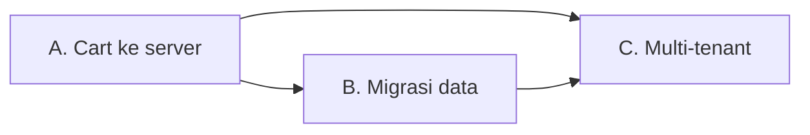

# Phase 8 — Rencana: Cart di Server, Migrasi Data, Multi-Tenant & Role

> Rencana saja. Belum ada kode diubah. Setiap klaim dirujuk ke berkas/baris nyata di repo.

## 0. Ringkasan tiga pekerjaan

| # | Pekerjaan | Masalah hari ini (fakta) |
|---|-----------|--------------------------|
| A | **Cart pindah ke server** | `src/lib/cart.ts:10` — `STORAGE_KEY = 'warung-pos.cart.v1'`, seluruh cart di `localStorage`; keranjang hilang kalau ganti perangkat |
| B | **Migrasi data lama → DB** | Semua key `warung-pos.*.v1/v2` di `localStorage` masih ada di perangkat lama dan belum pernah dibaca lagi sejak Phase 7 |
| C | **Multi-tenant + role** | `userId` hanya **ditulis** (`data.server.ts:334`, `:432`), **tidak pernah** jadi `WHERE`. `products`, `stock_movements`, `counters` bahkan tidak punya kolom tenant |

**Temuan penting yang menyederhanakan pekerjaan:**

1. **Hash auth lama kompatibel.** `git show 3a5f2ea:src/lib/auth.ts` memakai PBKDF2-SHA-256, 210.000 iterasi, 256-bit, salt base64 — identik dengan `src/lib/auth.server.ts`. Akun lama bisa diimpor **tanpa reset sandi**.
2. **Isolasi data benar-benar nol.** `listOrders` (`data.server.ts:360`) = `select().from(orders)` tanpa filter; `listProducts` (`:119`) sama. Jadi Phase 8C adalah *penambahan filter*, bukan perombakan query.
3. **Blocker skema untuk multi-tenant** (harus ditangani, kalau tidak dua toko akan saling bentrok):

| Constraint sekarang | Masalah | Perbaikan |
|---|---|---|
| `users_email_unique` (`schema.ts:27`) | Dua toko tak bisa punya `kasir@toko.id` sama | tetap global (email = identitas login) |
| `products_sku_unique` (`:50`) | SKU `MKN-001` hanya boleh ada sekali di seluruh sistem | jadikan unique per-tenant |
| `products_barcode_unique` (`:51`) | idem | jadikan unique per-tenant |
| `orders_number_unique` (`:83`) | `ORD-001` hanya boleh ada sekali; tiap toko ingin mulai dari ORD-001 | unique per-tenant |
| `counters` PK = `key` (`:126`) | satu counter untuk semua toko → nomor pesanan melompat | PK gabungan `(tenant_id, key)` |

---

## A. Cart pindah ke server

### A.1 Kenapa tidak sekadar pindah

Cart saat ini **sinkron**: `addToCart()` langsung mengubah state dan `useCart()` membacanya (`cart.ts:100`, `:92`). Kalau setiap tap jadi satu round-trip ke server, kasir melayani antrean akan merasakan lag. Jadi desainnya: **tulis lokal dulu, sinkron di belakang**.

### A.2 Model data

```ts
// tabel baru
carts        (id, tenant_id, user_id, status: 'open'|'parked', created_at, updated_at)
cart_items   (id, cart_id, product_id, name, emoji, price, cost, qty)  -- snapshot seperti order_items
```

Snapshot harga/HPP di `cart_items` mengikuti aturan yang sudah ada di `order_items` (`schema.ts`), sehingga keranjang yang diparkir lama tidak berubah harganya.

### A.3 Perubahan kode

| Berkas | Perubahan |
|---|---|
| `src/lib/cart.ts` | Tetap sebagai sumber kebenaran sinkron (in-memory + `localStorage` sebagai cache offline), **tambah**: `hydrateFromServer()`, `scheduleSync()` (debounce 500 ms), antrean mutasi saat offline |
| `src/lib/cart.functions.ts` *(baru)* | `getOpenCartFn`, `upsertCartFn`, `parkCartFn`, `resumeCartFn`, `deleteCartFn` |
| `src/lib/data.server.ts` | `loadOpenCart(userId)`, `saveCart(...)`, `listParkedCarts(userId)` |
| `src/routes/keranjang.tsx` | Tombol **Parkir** / **Lanjutkan** (UI untuk `parked`) |
| `src/routes/__root.tsx` | Setelah sesi resolve → `hydrateFromServer()`; saat logout → bersihkan cart lokal |
| `src/lib/auth.session.ts` | `logout()` juga `clearCart()` |

### A.4 Urutan & kriteria penerimaan

1. Tabel + RPC + hook sinkronisasi.
2. Hidrasi saat login; tulis-lokal-lalu-sinkron.
3. Parkir/lanjutkan.
4. **AC:** dua browser berbeda (dua sesi user yang sama) menampilkan isi keranjang yang sama; mematikan jaringan saat menambah item tidak kehilangan data (tersimpan lokal, tersinkron saat online); parkir 2 keranjang lalu pilih salah satu untuk dilanjutkan.

### A.5 Risiko

- **Konflik tulis** dua perangkat pada satu keranjang: selesaikan dengan `updated_at` *last-write-wins* per baris `cart_items`, bukan per keranjang. Catat di UI bila ada baris yang ditimpa.
- **Jangan** menyinkronkan setiap ketikan qty; debounce wajib.

---

## B. Migrasi data `localStorage` → DB

### B.1 Sumber data (key yang benar-benar ada di kode lama)

| Key | Isi | Tujuan di DB |
|---|---|---|
| `warung-pos.users.v1` | akun + `passwordHash` + `salt` | `users` (**hash dipakai apa adanya**) |
| `warung-pos.orders.v2` | pesanan + item | `orders` + `order_items` |
| `warung-pos.orders.v1` | format lama | `orders.v2` → lalu ikut |
| `warung-pos.products.v1` | katalog | `products` |
| `warung-pos.shifts.v1` | shift kas | `shifts` |
| `warung-pos.stock-movements.v1` | jejak stok | `stock_movements` |
| `warung-pos.order-seq.v1` | high-water mark nomor | `counters` (nilai `order_number`) |
| `warung-pos.cart.v1` | keranjang | `carts` + `cart_items` (dari pekerjaan A) |
| `warung-pos.session.v1` | id sesi lama | **dibuang** (sesi sekarang cookie) |

### B.2 Aturan yang tidak boleh dilanggar

1. **Idempoten.** Impor dua kali tidak boleh menggandakan. Kunci: `source_id` (id asli) → `insert ... on conflict do nothing`.
2. **Tidak destruktif.** Key `localStorage` **tidak dihapus** sampai pengguna menekan "Selesai" di ringkasan impor; ada tombol **Undo** (hapus baris yang berasal dari impor ini, dikenali lewat `import_batch_id`).
3. **Validasi ulang.** Setiap baris lewat skema Zod yang sama (`productDraftSchema`, dst.) — data `localStorage` bisa disunting tangan.
4. **Nomor pesanan aman.** `counters.order_number` di-set ke `max(nilai lama, max nomor di orders yang diimpor)` supaya tidak ada nomor terpakai ulang.
5. **Hash auth tidak diubah.** Karena format identik, impor hanya menyalin `passwordHash` + `salt`.
6. **Atribusi.** Karena multi-tenant, importer memilih: "jadikan data ini milik akun saya" (default) atau "buat toko baru".

### B.3 Alur UI

```
Masuk → ada data lama? → layar "Pulihkan Data" (jumlah per jenis)
      → Impor → ringkasan (N produk, M pesanan, K dilewati + alasan)
      → Selesai (hapus key)  |  Undo (batalkan impor)
```

Deteksi hanya di klien (`localStorage` tak ada di server) → route baru `/pulihkan`, `ssr: false`, guard sesi seperti route lain.

### B.4 Berkas

| Berkas | Peran |
|---|---|
| `src/lib/legacy.ts` *(baru)* | Pembaca + validator key lama (client-only, murni) |
| `src/lib/migration.functions.ts` *(baru)* | `importLegacyFn`, `undoImportFn`, `migrationStatusFn` |
| `src/lib/data.server.ts` | `importBatch(...)` dalam **satu transaksi** |
| `src/routes/pulihkan.tsx` *(baru)* | Layar impor + ringkasan + Undo |

### B.5 AC

Impor 14 produk + 2 pesanan + 1 shift dari `localStorage` → jumlah di DB sama; jalankan impor dua kali → jumlah tidak berubah; Undo → DB kembali seperti sebelum impor; pesanan lama tetap bisa dibuka struknya dan labanya tidak berubah.

### B.6 Risiko

- **Transaksi.** libSQL mendukung transaksi; impor harus dibungkus satu transaksi agar gagal di tengah tidak meninggalkan data separuh.
- **Data rusak.** Baris yang tidak lolos validasi **dilewati dan dilaporkan**, bukan menggagalkan seluruh impor.

---

## C. Multi-tenant + Role

### C.1 Model

```ts
tenants     (id, name, created_at)
memberships (id, tenant_id, user_id, role: 'owner'|'manager'|'cashier', created_at)  -- unique (tenant_id,user_id)
```

- `users` tetap global (email = identitas login).
- Seorang user bisa jadi anggota >1 tenant (mis. punya 2 warung).
- **`tenant_id` ditambahkan ke**: `products`, `orders`, `shifts`, `stock_movements`, `counters`, `carts`.

### C.2 Role & izin

| Aksi | owner | manager | cashier |
|---|---|---|---|
| Transaksi (kasir, checkout) | ✅ | ✅ | ✅ |
| Lihat riwayat/ringkasan/laporan | ✅ | ✅ | ❌ (hanya hari ini) |
| Kelola produk & stok | ✅ | ✅ | ❌ |
| Buka/tutup kas | ✅ | ✅ | ✅ |
| Void transaksi | ✅ | ✅ | ❌ |
| Undang/ubah role anggota | ✅ | ❌ | ❌ |
| Ubah pengaturan toko | ✅ | ❌ | ❌ |

### C.3 Penegakan (bagian yang paling mudah salah)

Aturan: **`tenant_id` dan `role` tidak pernah datang dari klien.**

```ts
// src/lib/tenant.server.ts (baru)
requireMembership(role?) // baca cookie sesi → membership → tenantId + role
```

Setiap server function di `data.functions.ts` memanggil `requireMembership(...)` lalu meneruskan `tenantId` ke `data.server.ts`. Setiap query di `data.server.ts` **wajib** ber-`where eq(table.tenantId, tenantId)`.

**Guard tambahan:** uji otomatis yang membaca `data.server.ts` dan gagal bila menemukan `select().from(<tabel ber-tenant>)` tanpa `where` ber-tenant. Ini yang mencegah kebocoran data saat ada query baru ditambahkan nanti.

### C.4 Perubahan skema (urutan aman untuk DB yang sudah berisi data)

1. `CREATE TABLE tenants, memberships`.
2. Buat tenant default "Warung Saya" + membership `owner` untuk **setiap** user yang sudah ada.
3. `ALTER TABLE ... ADD COLUMN tenant_id` (nullable) pada 6 tabel.
4. `UPDATE ... SET tenant_id = <tenant default>` untuk semua baris lama.
5. Backfill `orders.tenant_id` dari `orders.user_id` bila ada.
6. Ubah unique index jadi per-tenant:
   - `products_sku_unique` → `(tenant_id, sku)`
   - `products_barcode_unique` → `(tenant_id, barcode)`
   - `orders_number_unique` → `(tenant_id, order_number)`
7. Ubah `counters` PK → `(tenant_id, key)`.
8. (Opsional, langkah terpisah) jadikan `tenant_id` `NOT NULL`.

**Catatan SQLite:** `ALTER TABLE` terbatas; mengubah PK/unique butuh pola *buat tabel baru → salin → tukar nama*. Ini harus jadi migrasi bertahap yang bisa diuji, bukan satu perintah besar.

### C.5 UI

- Pemilih toko di menu akun (bila user punya >1 membership).
- Halaman `/anggota` (owner): daftar anggota, ubah role, undang lewat email.
- Sembunyikan menu yang tidak diizinkan (kosmetik) **dan** tolak di server (penegakan sebenarnya).

### C.6 AC

- User A tidak bisa melihat produk/pesanan/shift user B meski tahu ID-nya (uji: panggil `getOrderFn` dengan id milik tenant lain → `undefined`, bukan data).
- Kasir tidak bisa memanggil `voidOrderFn` (ditolak server, bukan hanya tombol disembunyikan).
- Dua tenant bisa sama-sama punya `ORD-001` dan SKU `MKN-001`.
- Semua data lama tetap terbaca setelah migrasi, tanpa perubahan angka laporan.

### C.7 Risiko

- **Kebocoran antar tenant** adalah risiko terbesar; mitigasi: guard otomatis + uji negatif lintas tenant.
- **Migrasi PK/unique** berisiko kehilangan data; mitigasi: `db:generate` menghasilkan SQL, tinjau manual, uji di database salinan dulu, dan siapkan langkah rollback.
- **Perubahan perilaku laporan:** setelah tenant aktif, `counters` per-tenant mengubah penomoran — pastikan tidak menabrak nomor lama.

---

## D. Urutan pengerjaan & dependensi



- **B bergantung pada A** hanya karena `cart` ikut dimigrasi; sisanya mandiri.
- **C dikerjakan terakhir** karena migrasi data (B) dan cart (A) paling mudah dilakukan selagi skema masih satu tenant. Kalau C lebih dulu, A dan B harus ikut membawa `tenant_id` sejak awal.
- Alternatif (kalau C lebih mendesak): kerjakan C dulu, lalu A dan B langsung dalam bentuk ber-tenant. Konsekuensi: A dan B jadi lebih rumit, tapi tidak ada pekerjaan yang diulang.

## E. Perintah DB yang dipakai

```bash
pnpm db:generate   # drizzle-kit generate → SQL di ./drizzle (terverifikasi jalan)
pnpm db:migrate    # drizzle-kit migrate  → terapkan migrasi berurutan
pnpm db:push       # drizzle-kit push     → sinkron cepat (dipakai saat dev)
```
`drizzle-orm/libsql/migrator` tersedia bila migrasi ingin dijalankan dari kode.

## F. Yang belum termasuk

- Backend multi-proses/caching (belum perlu).
- SSO / 2FA.
- Sinkronisasi realtime antar perangkat (cart pakai polling/debounce; websocket di luar lingkup).
