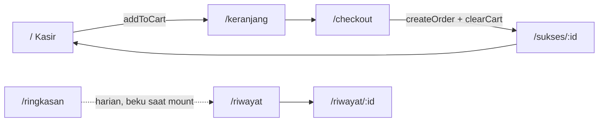
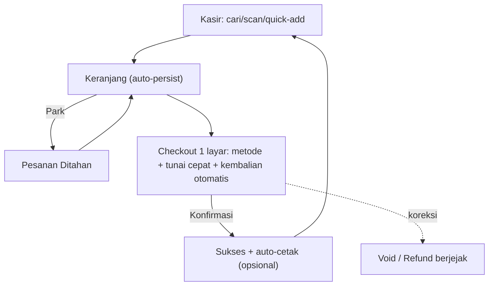

# Warung POS — Rencana Perbaikan Flow & Produktivitas

> Dokumen perencanaan. Belum ada perubahan kode. Semua temuan dirujuk ke file/simbol nyata di repo.

## 0. Tujuan & Prinsip

**Tujuan:** membuat POS yang (a) lebih cepat dipakai kasir, (b) menurunkan kesalahan input, (c) memberi insight penjualan/inventori/arus kas.

**Prinsip desain (dipakai untuk menilai setiap usulan):**

1. **Transaksi umum ≤ 3 tap / 0–1 ketikan.** Kasir melayani antrean, bukan menjelajah menu.
2. **Keyboard-first** di desktop, **thumb-first** di mobile. Dua jalur, satu state.
3. **Local-first dulu**, siap di-upgrade ke backend tanpa membongkar UI. (README saat ini: MVP localStorage — asumsi ini dipertahankan sampai Phase 6.)
4. **Tidak ada jalan buntu.** Setiap layar punya aksi lanjut yang jelas.
5. **Uang tidak boleh hilang.** Nomor order unik, transaksi tidak bisa dobel, void terjejak.

## 1. Kondisi Saat Ini (fakta dari kode)

Alur sekarang:



- State: `src/lib/cart.ts` (in-memory), `src/lib/products.ts` + `src/lib/orders.ts` (`localStorage` v1, pola `useSyncExternalStore`).
- Routing: `src/router.tsx`. Shell: `src/components/AppShell.tsx` (4 tab: Kasir, Produk, Riwayat, Ringkasan).
- Tidak ada test, tidak ada backend, tidak ada auth. `pnpm build`/`pnpm lint` hijau.

### 1.1 Peta permintaan → status → celah

| # | Permintaan | Status | Celah konkret |
|---|-----------|--------|---------------|
| R1 | Proses transaksi otomatis | ⚠️ Sebagian | Checkout manual; `amountPaid`/`change` **selalu `null`** (`CheckoutPage.placeOrder`), jadi uang diterima & kembalian tidak pernah tercatat; tak ada park/hold, tak ada void, tak ada shortcut. |
| R2 | Pelacakan jenis penjualan penting | ❌ Belum | Hanya dimensi `paymentMethod`. Tak ada kanal (dine-in/bungkus/ojol), kasir, shift, atau status order. |
| R3 | Pola penjualan detail | ❌ Belum | `/ringkasan` hanya **hari ini**, dibekukan saat mount (`SummaryPage` `useState(today)`). Tak ada tren, jam sibuk, produk terlaris, atau breakdown kategori. |
| R4 | Perbedaan harga / arus kas | ❌ Belum | `Product` tak punya `cost` → tak ada margin/laba. "Diskon Rp0" di-hardcode (`CheckoutPage`) tanpa model diskon. Tak ada arus kas masuk/keluar maupun tutup shift. |
| R5 | Tingkat inventaris efisien | ❌ Belum | `Product` tak punya `stock`/`sku`/`barcode`. Stok tidak pernah berkurang saat jual; tak ada peringatan stok menipis / restock. |
| R6 | Penjualan harian terperinci | ⚠️ Sebagian | Ada ringkasan hari ini, tetapi tak ada drill-down per hari, tutup kasir, atau ekspor. |

### 1.2 Bug & friksi flow (bukti kode)

| Prioritas | Masalah | Lokasi | Dampak |
|-----------|---------|--------|--------|
| P0 | Keranjang hilang saat refresh/tab ditutup | `src/lib/cart.ts` — `items` murni in-memory, tanpa `localStorage` | Kasir harus menyusun ulang pesanan; kehilangan waktu & kepercayaan. |
| P0 | `amountPaid`/`change` tak pernah diisi | `CheckoutPage.placeOrder` (kirim `null`) | Struk tak bisa menampilkan tunai & kembalian → sengketa kas. |
| P0 | Nomor order bisa bentrok | `orders.nextOrderNumber` — `todayCount + 1`, reset tiap hari | Setelah void/hapus, dua order bisa bernomor sama; laporan jadi ambigu. |
| P1 | Tombol bayar bisa dobel-klik | `CheckoutPage.placeOrder` — `setSubmitting(true)` lalu buat order sinkron | Dua order untuk satu pelanggan (race sebelum re-render). |
| P1 | Diskon palsu | `CheckoutPage` — baris "Diskon Rp0" statis | Menyesatkan; tak ada mekanisme diskon. |
| P1 | Ringkasan beku & harian saja | `SummaryPage` `useState(today)` | Lewat tengah malam data tidak berpindah hari sampai reload. |
| P1 | Tak ada void/refund | `OrdersPage`, `ReceiptPage` read-only | Salah input tak bisa dibatalkan. |
| P2 | Tak ada cari/barcode | `MenuPage` — grid + filter kategori saja | Katalog membesar → kasir lambat. |
| P2 | Label "N produk dipilih" = jumlah baris, bukan qty | `MenuPage` floating bar (`items.length`) | Info kuantitas menyesatkan. |
| P2 | Harga di keranjang beku tanpa peringatan | `cart.addToCart` menyimpan `price` saat tambah | Perubahan harga tak terlihat oleh kasir. |

## 2. Perbaikan Flow Inti (UX)

### 2.1 Alur baru (target)



### 2.2 Perubahan per layar

- **Kasir (`MenuPage`)**
  - Kolom cari (nama/SKU) + input barcode (scanner = keyboard wedge) → Enter menambah item.
  - Grid: badge qty benar (qty, bukan `items.length`), tombol `+/-` langsung di kartu, tap kartu = tambah.
  - Baris "Sering dibeli / Terakhir" untuk produk favorit.
  - Shortcut: `/` fokus cari, `F2` buka keranjang, `F4` bayar.
- **Keranjang (`CartPage`)**
  - Persist ke `localStorage` (auto-save tiap mutasi) + tombol "Park" & "Kosongkan".
  - Peringatan bila harga produk berubah sejak masuk keranjang.
- **Checkout (`CheckoutPage`)**
  - Satu layar: ringkasan, metode, **input uang tunai** dengan tombol cepat (20k/50k/100k/uang pas), kembalian otomatis.
  - Dukungan diskon nyata (nominal atau %), tercatat di order.
  - Guard anti-dobel: kunci sinkron saat submit (`useRef`), bukan hanya `disabled`.
- **Sukses/Struk (`SuccessPage`, `Receipt`)**
  - Tampilkan Tunai / Kembalian (memakai `amountPaid`/`change`).
  - Opsi auto-print & auto-fokus tombol "Transaksi Baru".
- **Riwayat (`OrdersPage`)**
  - Aksi **Void** (dengan alasan) dan **Cetak ulang**; badge status `dibayar`/`void`.
- **Ringkasan → Laporan (`SummaryPage`)**
  - Pemilih tanggal + navigasi hari; tidak beku saat mount (hitung ulang saat hari berganti).

## 3. Model Data yang Diusulkan

Perubahan `src/types.ts` (dengan migrasi `localStorage` v1 → v2, lihat §6):

```ts
interface Product {
  id: string
  name: string
  price: number
  cost: number          // HPP → margin (R4)
  stock: number         // inventori (R5)
  sku?: string
  barcode?: string
  active: boolean       // soft-hide tanpa hapus (jaga integritas riwayat)
  category: ProductCategory
  emoji: string
}

type SalesChannel = 'dine-in' | 'bungkus' | 'ojol'
type OrderStatus = 'paid' | 'void'

interface OrderItem {
  // ...existing...
  cost: number          // snapshot HPP saat jual → laba historis akurat
}

interface Order {
  // ...existing...
  status: OrderStatus
  channel: SalesChannel
  discount: number
  costTotal: number
  profit: number
  cashier?: string
  shiftId?: string
  voidedAt?: string
  voidReason?: string
}

interface Shift { id: string; openedAt: string; closedAt?: string; openingCash: number; closingCash?: number }
interface StockMovement { id: string; productId: string; delta: number; reason: 'sale' | 'restock' | 'adjust' | 'void'; at: string; orderId?: string }
```

**Aturan:** `OrderItem.cost` dan `Order.costTotal/profit` adalah *snapshot* — laba historis tidak boleh berubah saat HPP diedit.

## 4. Roadmap Bertahap

Setiap phase punya acceptance criteria yang bisa diuji manual. Urutan dipilih: fondasi dulu → nilai cepat → fitur besar.

### Phase 0 — Fondasi (R1, R6)
- Persist keranjang ke `localStorage` (`cart.ts`).
- Lapisan storage berversi + migrasi v1→v2 untuk produk & order.
- Guard anti-dobel di `placeOrder`.
- Perbaiki `nextOrderNumber` (counter monotonik, bukan `count+1`).
- Perkenalkan test runner (Vitest) untuk `orders`/`products`/`totals`/`cart`.
- **AC:** refresh tidak menghilangkan keranjang; klik dobel menghasilkan 1 order; nomor order unik setelah void; `pnpm test` hijau.

### Phase 1 — Transaksi Otomatis & Cepat (R1)
- Input tunai + kembalian; tombol uang cepat; `amountPaid`/`change` terisi & tampil di struk.
- Diskon nyata (nominal/%), tercatat.
- Park/hold order; keyboard shortcut (`/`, `F2`, `F4`); cari + barcode di Kasir.
- **AC:** jual tunai 3 item tercatat tunai/kembalian benar; order bisa di-park lalu dipanggil kembali; transaksi umum selesai ≤ 3 tap dari keranjang terisi.

### Phase 2 — Inventori (R5)
- `stock`/`sku`/`barcode` pada produk + form kelola.
- Pengurangan stok otomatis saat order dibuat; pemulihan saat void; `StockMovement` sebagai jejak.
- Peringatan stok menipis (ambang per produk) + daftar restock; blokir/peringatan saat jual melebihi stok.
- **AC:** stok turun tepat sejumlah qty; void mengembalikan stok; produk stok 0 ditandai dan tak bisa dijual (atau diberi konfirmasi).

### Phase 3 — Pelacakan Jenis Penjualan & Pola (R2, R3)
- `channel` (dine-in/bungkus/ojol), `cashier`, `shiftId` pada order + pemilih di checkout.
- Laporan pola: terlaris per produk/kategori, jam sibuk, tren 7/30 hari, breakdown kanal & metode.
- **AC:** laporan menampilkan top-N produk & jam sibuk dari data nyata; filter kanal mengubah angka.

### Phase 4 — Harga, Margin & Arus Kas (R4)
- `cost` (HPP) per produk; `profit`/`costTotal` per order; laporan margin.
- Diskon (dari Phase 1) terlihat di analitik.
- Shift kasir: buka/tutup, kas awal, kas akhir, selisih (arus kas).
- **AC:** laba = total − HPP − diskon; tutup shift menampilkan selisih kas yang diharapkan vs aktual.

### Phase 5 — Laporan Harian Terperinci (R6)
- Halaman Laporan: pemilih hari, ringkasan, drill-down per transaksi, ekspor CSV/print.
- Laporan tutup kasir (Z-report) yang bisa dicetak.
- **AC:** pilih tanggal apa pun → angka konsisten dengan riwayat; ekspor CSV memuat baris yang sama.

### Phase 6 — Backend & Multi-Perangkat (opsional)
- Sinkronisasi server, multi-kasir, auth/role. Tidak menyentuh UI inti bila storage layer (§Phase 0) abstraksi bersih.

## 5. Prioritas (Dampak × Usaha)

| Usaha rendah | Usaha tinggi |
|---|---|
| **Dampak tinggi** | P0/P1 §1.2, Phase 0, Phase 1, stok dasar (Phase 2) | Phase 4 (margin/shift), Phase 6 |
| **Dampak sedang** | Label/badge, auto-print, pemilih hari | Phase 3 pola lanjutan |

## 6. Risiko & Keputusan

- **Migrasi data:** `localStorage` v1 sudah berisi produk/order. Wajib migrasi idempoten (v1→v2) yang mengisi `cost=0`, `stock=∞` (atau nilai default), `status='paid'`, `channel='dine-in'` untuk data lama. Salah migrasi = kehilangan riwayat.
- **Snapshot biaya:** `OrderItem.cost` wajib; tanpa itu laporan margin historis berubah saat HPP diedit.
- **Batas `localStorage`** (~5 MB): order lama perlu retensi/arsip saat Phase 5–6.
- **Barcode scanner:** diasumsikan keyboard-wedge (tanpa SDK). Perlu field input tersembunyi yang selalu fokus.
- **Keputusan terbuka:** tetap frontend-only sampai Phase 6 (default, sesuai README) vs backend lebih awal. Rencana ini memilih frontend-only dulu.

## 7. Definisi "Selesai" untuk Tujuan Awal

- **Lebih mudah:** transaksi umum ≤ 3 tap, keranjang tahan refresh, kembalian otomatis, cari/scan.
- **Produktivitas naik:** tanpa dobel-order, void berjejak, laporan pola + margin + arus kas tersedia, stok terjaga otomatis.

## 8. Phase 0 (dieksekusi) — Migrasi ke TanStack Start

**Tujuan:** memenuhi modal perintah TanStack Start tanpa mengubah model aplikasi (tetap local-first, tanpa backend).

| Persyaratan | Status | Bukti |
| ----------- | ------ | ----- |
| File-based TanStack Router routes | ✅ | `src/routes/{__root,index,keranjang,checkout,sukses.$orderId,riwayat.index,riwayat.$orderId,produk,ringkasan,api.health}.tsx`; `routeTree.gen.ts` digenerate otomatis |
| Validated search params | ✅ | `zod` schema di `/riwayat` (`q`, `method`, `day`), `/produk` (`kategori`), `/ringkasan` (`day`); `.catch()` untuk fallback |
| Route loaders | ✅ | `/riwayat` (filter order), `/ringkasan` (tanggal laporan otoritatif dari server) |
| Typed server functions | ✅ | `src/lib/reporting.functions.ts`: `fetchReportingDay`, `streamCategoryBreakdown` |
| Full-document SSR | ✅ | `shellComponent` di `__root.tsx`; HTML server memuat `<html lang="id">`, `<head>`, `<body>` |
| Streaming | ✅ | `streamCategoryBreakdown` async generator → dikonsumsi `for await` di `CategoryBreakdown` |
| Explicit server boundary | ✅ | `src/lib/reporting.server.ts` (`createServerOnlyFn`); terverifikasi **tidak ada** kode server-only di `dist` klien |
| SSR mode per route | ✅ | `false` untuk route ber-`localStorage`; `data-only` untuk `/ringkasan` |
| Runtime target tanpa ubah model | ✅ | Nitro preset `node-server`; `.output/server/index.mjs`; `pnpm start` |

**Verifikasi yang dijalankan:** `pnpm build` (tsc + vite + nitro) hijau; `pnpm lint` bersih; server produksi dijalankan di port 3100; `/api/health` → `{"status":"ok","runtime":"node"}`; E2E browser: Kasir → Keranjang → Checkout (Tunai & QRIS) → ORD-001/ORD-002 → Struk → Riwayat (cari/filter) → Ringkasan (streaming kategori) berfungsi.

**Catatan:** `ssr: false` pada route ber-`localStorage` adalah pilihan sadar — merender HTML dari data yang tidak ada di server hanya menghasilkan flash konten kosong. Shell dokumen tetap SSR di semua route.

**Belum dikerjakan (sesuai instruksi "jangan dulu backend side"):** Phase 2–5 pada §4.

## 9. Phase 1 (dieksekusi) — Transaksi Otomatis & Cepat

**Tujuan:** menutup P0/P1 §1.2 dan R1. Semua tetap frontend + `localStorage`.

| Item | Status | Bukti |
| ---- | ------ | ----- |
| Keranjang bertahan saat refresh (P0) | ✅ | `cart.ts` persist ke `warung-pos.cart.v1`; terverifikasi badge `2` sebelum & sesudah reload |
| Tunai & kembalian tercatat (P0) | ✅ | `CheckoutPage` tombol uang cepat + input; order menyimpan `amountPaid`/`change`; struk menampilkannya (Rp50.000 − Rp26.000 = Rp26.600 setelah diskon) |
| Nomor order monotonik (P0) | ✅ | High-water mark `warung-pos.order-seq.v1`; setelah ORD-004 di-void, penjualan berikutnya = ORD-005 (**tidak** memakai ulang 004) |
| Guard dobel-klik (P1) | ✅ | Latch `useRef` sinkron; dua klik dalam satu tick → **1** order |
| Diskon nyata (P1) | ✅ | `discountValue()` di `totals.ts` (Rp atau %, di-clamp ke subtotal); tampil di checkout, struk, dan riwayat |
| Migrasi `orders.v1 → v2` | ✅ | Order lama tanpa `discount` tetap terbaca; `discount` diisi dari `subtotal − total`; key lama dihapus |
| Peringatan harga berubah (P2) | ✅ | `stalePriceIds()` + banner di keranjang |

**Catatan koreksi:** klaim awal bahwa penomoran sudah aman dari void ternyata **salah** — diuji, ORD-004 terpakai ulang setelah dihapus. Perbaikan: high-water mark terpisah, lalu diuji ulang (ORD-005). 

**Verifikasi dijalankan:** `pnpm build` + `pnpm lint` hijau; server produksi :3100; Chromium E2E untuk persistensi keranjang, tunai/kembalian, diskon persen, guard dobel-klik, penomoran setelah void, migrasi v1, peringatan harga, dan validasi tunai kurang.

**Belum:** Phase 4–5.

## 10. Phase 2 (dieksekusi) — Inventori

**Tujuan:** menutup R5 dan menambahkan void (P1 §1.2). Semua tetap frontend + `localStorage`.

| Item | Status | Bukti |
| ---- | ------ | ----- |
| Field stok pada produk | ✅ | `Product.stock` (`null` = tidak dilacak), `lowStockThreshold`, `sku`, `barcode`; data lama dinormalisasi otomatis |
| Pengurangan stok otomatis | ✅ | Jual 2 Indomie: 40 → 38; `StockMovement {delta:-2, reason:'sale', orderId}` tercatat |
| Pemulihan stok saat void | ✅ | Void ORD-001: stok 38 → 40, movement `{delta:+2, reason:'void'}` |
| Void transaksi | ✅ | `voidOrder()` idempoten, menyimpan `voidedAt`/`voidReason`, badge VOID di riwayat |
| Peringatan stok menipis | ✅ | Banner "N produk perlu restock" + filter `?menipis=true`; Keripik Kentang (8 ≤ 10) muncul |
| Restock cepat | ✅ | Tombol +10: 8 → 18, movement `reason:'restock'` |
| Barcode & SKU | ✅ | Cari nama/SKU/barcode di Kasir; scan barcode + Enter menambah produk (terverifikasi: `8991002101027` → Es Teh Manis) |
| Blokir stok habis | ✅ | Stok 0 → label "Stok habis", kartu `disabled` |
| Void dikecualikan dari laporan | ✅ | Ringkasan: 1 void → omzet Rp0, "0 transaksi · 1 void"; riwayat menampilkan "bersih Rp0" |

**Verifikasi dijalankan:** `pnpm build` + `pnpm lint` hijau; server produksi :3100; Chromium E2E untuk pengurangan stok, void + pemulihan stok, laporan mengabaikan void, filter stok menipis, restock, scan barcode, dan blokir produk habis.

## 11. Phase 3 (dieksekusi) — Jenis & Pola Penjualan

**Tujuan:** menutup R2 & R3.

| Item | Status | Bukti |
| ---- | ------ | ----- |
| Jenis pesanan (`channel`) | ✅ | `SalesChannel` (`dine-in`/`bungkus`/`ojol`) di checkout; order ORD-001 `dine-in`, ORD-002 `ojol`; tampil di struk & riwayat |
| Nama kasir | ✅ | Input opsional; tersimpan & tampil di struk ("Budi", "Siti") |
| Produk terlaris | ✅ | `topProducts()`; ringkasan menampilkan peringkat + qty + omzet |
| Pola jam / jam tersibuk | ✅ | `hourHistogram()` + `busiestHour()`; "Paling ramai sekitar pukul 18:00 (2 transaksi)" |
| Split jenis pesanan | ✅ | `channelBreakdown()`; Makan di Sini Rp18.000 vs Ojol Rp11.000 |
| Tren 7 hari | ✅ | `revenueTrend()`; grafik batang 7 hari, hari terpilih ditonjolkan |
| Filter jenis di riwayat | ✅ | `?channel=ojol` → 1 dari 2 transaksi |

**Verifikasi dijalankan:** `pnpm build` + `pnpm lint` hijau; server produksi :3100; Chromium E2E untuk capture kanal/kasir, struk, analitik pola, dan filter kanal.

**Catatan:** seluruh helper analitik murni (`src/lib/analytics.ts`) — belum dipindah ke server function karena sumber datanya masih `localStorage`; bentuknya sengaja siap dipindah tanpa mengubah tipe saat backend ditambahkan.

## 12. Phase 4 (dieksekusi) — Harga, Margin & Arus Kas

**Tujuan:** menutup R4 (perbedaan harga/margin dan arus kas).

| Item | Status | Bukti |
| ---- | ------ | ----- |
| HPP per produk | ✅ | `Product.cost` + input di form produk; seed katalog diberi HPP realistis |
| Snapshot HPP per baris | ✅ | `OrderItem.cost` di-snapshot saat masuk keranjang |
| Laba historis stabil | ✅ | HPP katalog diubah 11.000 → 20.000 **setelah** penjualan; laba tetap Rp14.000 (snapshot tetap 11.000) |
| `costTotal` & `profit` per order | ✅ | 2× Nasi Goreng: subtotal 36.000, costTotal 22.000, profit 14.000 |
| Kartu laba/HPP/margin | ✅ | Ringkasan: Laba Rp14.000 · HPP Rp22.000 · Margin 39% |
| Shift kas | ✅ | `src/lib/shifts.ts`: buka (modal 100.000), tutup (dihitung 135.000) |
| Kas seharusnya | ✅ | 100.000 + 36.000 = **Rp136.000** (penjualan tunai saja; QRIS/transfer tidak masuk) |
| Selisih kas | ✅ | Dihitung 135.000 → selisih **−Rp1.000 (kurang)**; ditandai lebih/kurang/pas |
| Atribusi order ke shift | ✅ | Order menyimpan `shiftId` saat kas terbuka |

**Verifikasi dijalankan:** `pnpm build` + `pnpm lint` hijau; server produksi :3100; Chromium E2E untuk margin, kas seharusnya, tutup kas + selisih, dan kekekalan snapshot HPP.

**Perbaikan ditemukan saat uji:** panel kas awalnya hanya dirender pada kondisi "ada transaksi", sehingga kas tidak bisa dibuka sebelum penjualan pertama. Diperbaiki: panel juga dirender di empty state.

## 13. Phase 5 (dieksekusi) — Laporan Harian, CSV & Z-Report

**Tujuan:** menutup R6 (penjualan harian terperinci) dan melengkapi alur tutup kas.

| Item | Status | Bukti |
| ---- | ------ | ----- |
| Halaman laporan harian | ✅ | Route `/laporan` + item navigasi "Laporan"; memuat tanggal dari server function (`ssr: 'data-only'`) |
| Pemilih tanggal | ✅ | Tombol hari berdata + `<input type="date">`; `?tanggal=<dayKey>` |
| Hari tanpa data | ✅ | `?tanggal=<kemarin>` → empty state, **bukan** angka hari ini |
| Ringkasan harian | ✅ | Omzet Rp16.000 · Laba Rp6.000 · Margin 38% · Selisih kas +Rp500 |
| Rincian pembayaran & jenis | ✅ | Tunai 1× Rp16.000; Makan di Sini 1× Rp16.000 |
| Rekonsiliasi kas per shift | ✅ | Seharusnya Rp66.000 · dihitung Rp66.500 · +Rp500 |
| Drill-down transaksi | ✅ | Daftar transaksi per hari, klik menuju struk (`/riwayat/$orderId`) |
| Ekspor CSV | ✅ | Header lengkap + baris item; `ORD-001,…,Budi,Mie Ayam Bakso,1,16000,10000,16000,0,16000,6000` |
| Z-Report | ✅ | Teks siap cetak/unduh (omzet, HPP, laba, diskon, pembayaran, jenis, kas, total bersih) |
| Void dikecualikan | ✅ | Satu transaksi di-void → omzet Rp0, laba Rp0, "0 transaksi"; baris VOID tetap terlihat di daftar |

**Verifikasi dijalankan:** `pnpm build` + `pnpm lint` hijau; server produksi :3100; Chromium E2E untuk agregasi laporan, pemilih tanggal (termasuk hari kosong), rekonsiliasi kas, isi CSV, teks Z-Report, dan pengecualian void.

## 14. Status Akhir

Seluruh Phase 0–5 selesai dan terverifikasi. Ringkas:

| Phase | Fokus | Status |
| ----- | ----- | ------ |
| 0 | Migrasi TanStack Start (file-based routes, search params, loader, server fn, SSR, streaming, boundary, runtime Nitro) | ✅ |
| 1 | Transaksi otomatis & cepat (persist keranjang, tunai/kembalian, diskon, guard dobel, nomor monotonik) | ✅ |
| 2 | Inventori (stok, SKU/barcode, auto-decrement, low-stock, void + restore) | ✅ |
| 3 | Jenis & pola penjualan (kanal, kasir, terlaris, jam sibuk, tren 7 hari) | ✅ |
| 4 | Harga, margin & arus kas (HPP + snapshot, laba/margin, shift + selisih kas) | ✅ |
| 5 | Laporan harian (pemilih tanggal, drill-down, CSV, Z-Report) | ✅ |

**Belum dikerjakan (sesuai instruksi "jangan dulu backend side"):** Phase 6 — backend/multi-perangkat/auth. Model aplikasi tetap local-first; seluruh tipe dan helper analitik sudah dibentuk agar bisa dipindah ke server tanpa mengubah kontrak UI.

## 15. Phase 6 (dieksekusi) — Validasi Input & Autentikasi

**Tujuan:** (a) setiap input bersih dan tervalidasi, terhindar dari HTML injection; (b) register / login / logout.

### 15.1 Validasi & anti-injection

| Item | Status | Bukti |
| ---- | ------ | ----- |
| Modul validasi terpusat | ✅ | `src/lib/validation.ts` — semua skema Zod berkumpul di satu tempat |
| Audit sink berbahaya | ✅ | `grep` untuk `dangerouslySetInnerHTML`/`innerHTML`/`eval`/`javascript:` → **nol kecocokan** |
| Sanitasi tag markup | ✅ | `Es Jeruk…` → `img src=x onerror=alert(1)Es Jeruk…` (tanpa `<`/`>`) |
| Sanitasi karakter kontrol | ✅ | NUL/BEL dan rentang C0/C1 dibuang; diverifikasi tidak ada kontrol tersimpan |
| Batas panjang | ✅ | Nama 200+ karakter ditolak: "Maksimal 120 karakter" |
| Validasi angka | ✅ | `numberField` + `rupiah`/`priceRupiah`/`discountPercent`; harga non-bulat/negatif ditolak |
| Validasi terapan | ✅ | Form produk, checkout, buka/tutup kas, register, login |

### 15.2 Autentikasi

| Item | Status | Bukti |
| ---- | ------ | ----- |
| Register | ✅ | `/masuk` mode register; akun tersimpan, sesi langsung aktif |
| Normalisasi email | ✅ | `"  KASIR@Warung.ID  "` → `kasir@warung.id` |
| Hash kata sandi | ✅ | PBKDF2-SHA-256 210k iterasi + salt 16 byte; `passwordStored: false` di storage |
| Login | ✅ | Kredensial benar → masuk ke aplikasi |
| Logout | ✅ | Menu akun → Keluar; sesi dihapus, akun tetap ada, dialihkan ke `/masuk` |
| Anti-enumerasi akun | ✅ | Email tak dikenal dan kata sandi salah memberi pesan **identik** |
| Validasi form | ✅ | Email salah + sandi pendek + konfirmasi beda → 3 pesan, **tidak** ada akun tersimpan |
| Gate akses | ✅ | Tanpa sesi, semua route menampilkan layar masuk (shell aplikasi tidak dirender) |

**Verifikasi dijalankan:** `pnpm build` + `pnpm lint` hijau; server produksi :3100; Chromium E2E untuk gate auth, validasi register, normalisasi + hashing, injeksi nama produk (3 vektor), batas panjang, logout, login gagal (2 kasus), login sukses, dan transaksi penuh di belakang auth.

**Catatan keamanan (jujur):** auth ini **bukan** batas keamanan terhadap pemilik perangkat — auth client-side tidak mungkin begitu. Ini gerbang akses untuk staf shift pada satu perangkat. Yang benar-benar ditegakkan: kata sandi tidak pernah disimpan mentah, pesan gagal tidak membocorkan keberadaan akun, dan API-nya berbentuk sama seperti auth server sehingga penggantian nanti bersifat mekanis.


