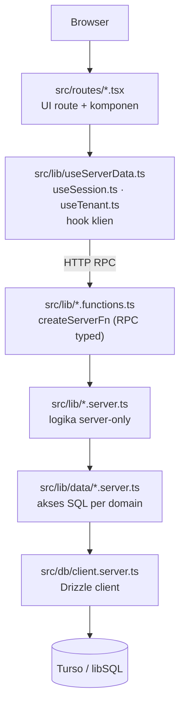
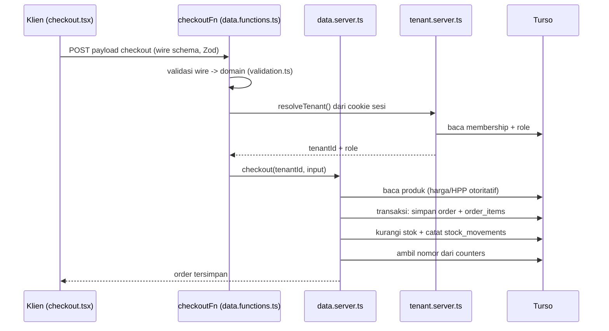

# Architecture

Dokumen ini menjelaskan cara Warung POS disusun: lapisan kode, alur request, isolasi tenant, dan aturan boundary server/client.

## 1. Gambaran

Warung POS adalah aplikasi full-stack TanStack Start. Server merender shell HTML (`__root.tsx`), lalu route yang bergantung pada data klien dirender di browser (`ssr: false`). Data bisnis tersimpan di Turso (libSQL) lewat Drizzle ORM.

Prinsip utama:

- **Server otoritatif.** Harga, HPP, stok, nomor pesanan, dan verifikasi password dihitung di server. Klien hanya mengirim niat.
- **Isolasi tenant.** `tenant_id` dan `role` tidak pernah berasal dari klien. Server membacanya dari sesi.
- **Snapshot baris.** `order_items` dan `cart_items` menyimpan nama, harga, dan HPP saat transaksi, sehingga edit katalog tidak mengubah riwayat.

## 2. Lapisan

Aturan tiap lapisan:

| Lapisan | Pola berkas | Peran |
| ------- | ----------- | ----- |
| Route | `src/routes/*.tsx` | Komponen halaman, form, navigasi. |
| Hook klien | `src/lib/use*.ts` | Bungkus pemanggilan server function jadi state React. |
| RPC | `src/lib/*.functions.ts` | `createServerFn`; aman diimpor dari klien, bundler menggantinya dengan stub. |
| Server-only | `src/lib/*.server.ts` | Auth, sesi, env, resolusi tenant, validasi. Dibungkus `createServerOnlyFn`, gagal keras bila dipanggil dari klien. |
| Data | `src/lib/data/*.server.ts` | Satu berkas per domain (orders, products, shifts, carts, stock). Semua query difilter `tenantId`. |
| DB | `src/db/client.server.ts` | Klien Drizzle. |
| Skema | `src/db/schema.ts` | Definisi tabel. Terapkan dengan `pnpm db:push`. |

## 3. Alur request

Contoh: kasir menekan tombol konfirmasi checkout.

Titik penting:

- Klien **tidak** mengirim harga final; server menghitung ulang dari katalog.
- Nomor pesanan diambil dari tabel `counters`, jadi void atau hapus tidak memakai ulang nomor.
- Stok berubah setelah order tersimpan, supaya kegagalan tidak memotong stok tanpa order.

## 4. Isolasi tenant

Setiap toko adalah satu **tenant**. Satu user dapat tergabung ke beberapa tenant lewat `memberships` dengan role `owner`, `manager`, atau `cashier`.

- Server membaca `tenant_id` dan `role` dari cookie sesi, bukan dari body request.
- Role membatasi server function, bukan sekadar menyembunyikan tombol di UI.
- `scripts/check-tenant-scoping.mjs` memindai `src/lib/data/*.server.ts` dan gagal bila ada akses ke tabel tenant tanpa predikat `tenantId`. Jalankan dengan `pnpm check:tenant`.

## 5. Autentikasi & sesi

- Password di-hash PBKDF2-SHA-256 (210.000 iterasi, salt acak per user) dan hanya diverifikasi di server. Hash tidak pernah dikirim ke browser.
- Sesi memakai cookie terenkripsi `warung-pos` (`httpOnly`, `sameSite=lax`, `secure` di produksi) yang dikelola TanStack Start.
- Pesan gagal login identik untuk email tak dikenal dan password salah, mencegah enumerasi akun.
- Instalasi baru (0 akun) diarahkan otomatis ke mode Daftar.

## 6. Validasi

Satu modul Zod (`src/lib/validation.ts`) dipakai di klien dan server. Server function memvalidasi ulang setiap payload, jadi request buatan tangan tidak bisa melewati aturan UI.

- **Skema wire** (mis. `checkoutFormSchema`) memvalidasi bentuk transport mentah.
- **Skema domain** (mis. `checkoutSchema`) adalah bentuk terpercaya setelah normalisasi.
- Sanitasi saat input membuang karakter kontrol dan markup; React meng-escape saat output, dan aplikasi tidak memakai `dangerouslySetInnerHTML`.

## 7. Boundary server/client

| Pola | Dijalankan di | Aman diimpor dari klien |
| ---- | ------------- | ----------------------- |
| `src/routes/*.tsx` | Klien (+ shell SSR) | — |
| `src/lib/*.functions.ts` | Server (via RPC) | Ya |
| `src/lib/*.server.ts` | Server saja | Tidak (gagal keras) |
| `src/lib/data/*.server.ts` | Server saja | Tidak |
| `src/db/*.server.ts` | Server saja | Tidak |
| `src/lib/*.ts` | Klien | Ya |

Rahasia (`TURSO_ACCESS_TOKEN`, `passwordHash`, `libsql://`) tidak boleh muncul di bundle klien.

## 8. Route

| URL | Berkas | Render |
| --- | ------ | ------ |
| `/` | `index.tsx` | klien (`ssr: false`) |
| `/keranjang` | `keranjang.tsx` | klien (`ssr: false`) |
| `/checkout` | `checkout.tsx` | klien (`ssr: false`) |
| `/sukses/$orderId` | `sukses.$orderId.tsx` | SSR + loader |
| `/riwayat` | `riwayat.index.tsx` | SSR + loader (filter lewat search param) |
| `/riwayat/$orderId` | `riwayat.$orderId.tsx` | SSR + loader |
| `/produk` | `produk.tsx` | SSR + loader |
| `/ringkasan` | `ringkasan.tsx` | `data-only` |
| `/laporan` | `laporan.tsx` | `data-only` |
| `/anggota` | `anggota.tsx` | klien (`ssr: false`) |
| `/pulihkan` | `pulihkan.tsx` | klien (`ssr: false`) |
| `/masuk` | `masuk.tsx` | SSR + loader |
| `/api/health` | `api.health.ts` | server route |

`ssr: false` menandai route yang hanya bisa dirender di klien (mis. butuh `localStorage` atau state keranjang). Route lain menjalankan loader di server saat SSR, lalu hydrate di klien. `data-only` merender data dari server tanpa shell halaman penuh.
